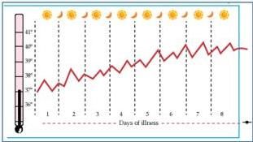
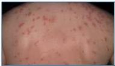
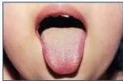

4A

# MANIFESTASI KLINIS

## Anamnesis:
- Demam dengan pola intermiten dan kenaikan suhu **step-ladder**
- Konstipasi/diare, meteorismus, mual, muntah, nyeri abdomen
- Gejala berat -&gt; penurunan kesadaran, kejang dan ikterus
- Gejala penyerta lain: nyeri otot, batuk, anoreksia dan insomnia, malaise

## Pemeriksaan fisik:
- **Bradikardi relative** (setiap peningkatan 1°C, tidak diikuti kenaikan HR)
- **Rose spot** (rash pada punggung)
- **Typhoid tongue** (bagian tengah kotor dan bagian pinggir hiperemis)
- Nyeri epigastric, hepatosplenomegaly

## Keadaan lanjut:
- Nyeri perut dengan tanda-tanda akut abdomen

- **Tifoid karier**: Salmonella (+) dalam feses pasien selama 1 tahun, tanpa gejala klinis

Kelon Complete Batch Nov 2025

MEDIKO.ID

(PAPDI, 2014) Hal, 549