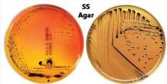
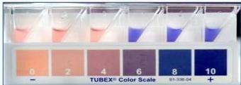

4A

# PENUNJANG

- LAB RUTIN: Anemia, leukopenia, limfositosis relative, monositosis, trombositopenia ringan
- WIDAL: dilakukan setelah minggu 1, positif apabila kenaikan titer 0 ≥1:320, atau kenaikan titer 4x, titer H ≥1:640
- TUBEX TF: dilakukan hari 4-5, deteksi IgM terhadap antigen 09
- Typhidot: dilakukan hari 4-5, deteksi IgM dan IgG

Media:
- SS Agar
- XLD agar
- OX-gall

Minggu 1
Darah dan sumsum

Minggu 2
Feses

Minggu 3
Urin

MEDIKOLOGIC

DFU
Darah: Minggu 1 (gold standard)
Feses: Minggu 2
Urin: Minggu 3

Kelon Complete Batch Nov 2025

MEDIKO.ID

(PAPDI, 2014) Hal. 549