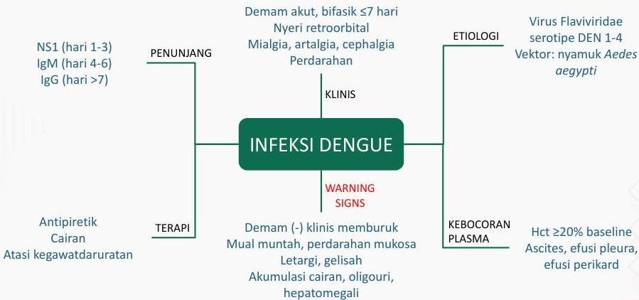

INFEKSI DENGUE

Kelon Complete Batch Nov 2025

MEDIKO.ID

(PNPK DENGUE, 2020) Hal. 5

4A

2020

KELON

2020

NS1 (hari 1-3)
IgM (hari 4-6)
IgG (hari &gt;7)

Antipiretik
Cairan
Atasi kegawatdaruratan

PENUNJANG

TERAPI

Demam akut, bifasik ≤7 hari
Nyeri retroorbital
Mialgia, artalgia, cephalgia
Perdarahan

KLINIS

INFEKSI DENGUE

WARNING
SIGNS

Demam (-) klinis memburuk
Mual muntah, perdarahan mukosa
Letargi, gelisah
Akumulasi cairan, oligouri,
hepatomegali

ETIOLOGI

KEBOCORAN
PLASMA

Virus Flaviviridae
serotipe DEN 1-4
Vektor: nyamuk Aedes aegypti

Hct ≥20% baseline
Ascites, efusi pleura,
efusi perikard