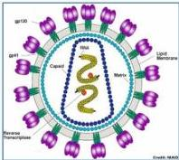
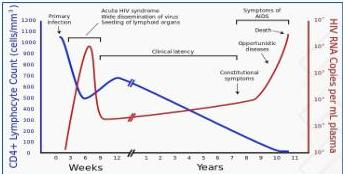

HIV/AIDS

# DEFINISI

- HIV adalah virus RNA yang menyebabkan AIDS, yaitu sekumpulan gejala berkurangnya kemampuan imunitas tubuh.
- Penularan: darah, produk darah, duh genital, cairan tubuh, amnion, dan ASI.
- Faktor risiko: wanita penjaja seks, penasun, LSL, transgender, dsb.

# STADIUM

- Serokonversi: infeksi dengan HIV, mulai terbentuknya antibodi HIV.
- Asimptomatik: tidak terdapat tanda dan gejala HIV, belum terdapat supresi sistem imun
- Simptomatik: terdapat tanda dan gejala infeksi HIV, sudah terdapat supresi sistem imun.
- AIDS: terdapat infeksi opportunistik, stadium end-stage.

Kelon Complete Batch Nov 2025

MEDIKO.ID

(PAPDI, 2014) Hal. 888

4A