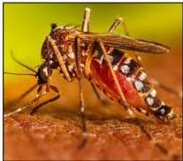
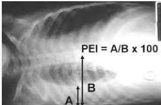

4A

# DEFINISI

Infeksi akibat virus dengue (famili Flaviviridae), ditularkan oleh nyamuk betina Ae. aegypti dan Ae. albopictus

4 Serotipe: DEN-1, DEN-2, DEN-3, serta DEN-4.

Teori 1: secondary heterologous infection hypothesis
Teori 2: gejala berat jika terinfeksi serotipe virus dengue yang paling virulen

# MEDIKOLOGIC

Demam dengue VS DBD

Ada atau tidak plasma leakage atau trombositopenia berat (&lt;100.000)

Kebocoran plasma:
- HT &gt; 20% dari baseline pasien
- HT turun &gt; 20% dari nilai awal setelah rehidrasi
- Ada kebocoran cairan di ruang ke-3: asites, efusi pleura
- Tanda lain: hipoalbumin, peningkatan laktat serum, edema gallblader

Kelon Complete Batch Nov 2025

MEDIKO.ID

(PNPK DENGUE, 2020) Hal. 5