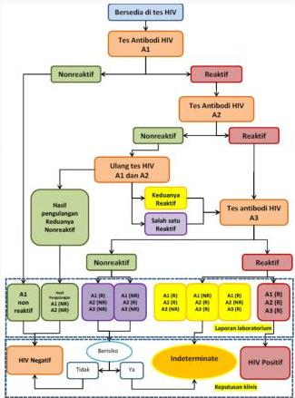

4A

# Deteksi Serologis HIV

- Contoh: Rapid Test, ELISA, Western Blot
- Pilihan utama (rekomendasi WHO) untuk screening = Rapid Test

# Deteksi Virologis

- Deteksi viral replication rate, contoh: PCR.
- Bisa dipakai untuk screening bayi baru lahir.

CD4 : Wajib diperiksa jika + HIV

# TEST ANTIBODI HIV

- 3 strategi (3 pemeriksaan).
- Didahului dengan konseling pra-tes dan informasi.
- Ketiga tes tersebut dapat menggunakan reagen tes cepat (rapid test) atau ELISA.
- Pemeriksaan pertama (A1) harus menggunakan tes dengan sensitivitas tinggi (&gt;99%).
- Pemeriksaan selanjutnya (A2 dan A3) menggunakan tes dengan spesifisitas tinggi (&gt;99%).

Kelon Complete Batch Nov 2025

MEDIKO.ID

(PAPDI, 2014) Hal. 890