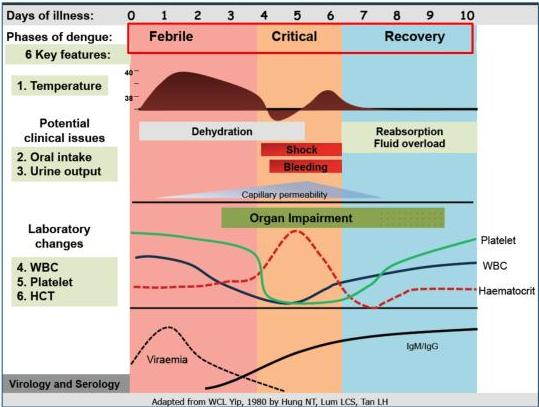
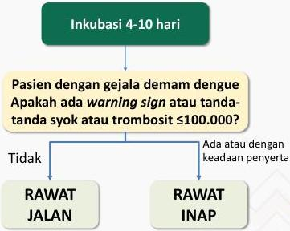

#

# Perjalanan Infeksi Dengue

# Inkubasi 4-10 hari

Pasien dengan gejala demam dengue Apakah ada warning sign atau tanda-tanda syok atau trombosit ≤100.000?

Kelon Complete Batch Nov 2025

MEDIKO.ID

(PNPK DENGUE, 2020) Hal. 16

4A