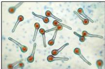

TETANUS

# DEFINISI

Penyakit akut akibat eksotoksin (tetanolisin dan tetanospasmin) bakteri *Clostridium tetani* (bakteri gram (+) anaerob yang memberikan gambaran seperti drumstick).

# FAKTOR RISIKO

- Riwayat vaksinasi tidak lengkap
- Luka kotor → bekas tertusuk paku berkarat
- Usia &gt;60 tahun

*Clostridium tetani*

|  Luka rentan tetanus (Luka Kotor) | Luka yang tidak rentan tetanus (Luka Bersih)  |
| --- | --- |
|  >6-8jam | <6 jam  |
|  Kedalaman >1cm | Superfisial <1cm  |
|  Terkontaminasi | Bersih  |
|  Bentuk stelat, avulsi, atau hancur (irreguler) | Bentuknya linear, regular, tepi tajam  |
|  Denervasi, iskemik | Neurovaskular intak  |
|  Terinfeksi (purulent, jaringan nekrotik) | Tidak infeksi/kontaminasi  |

Kelon Complete Batch Nov 2025

MEDIKO.ID

(KEMENKES, 2022) Hal. 501

4A