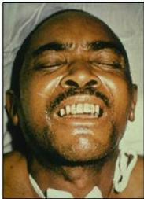
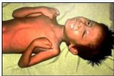
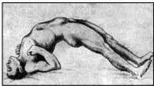

Kelon Complete Batch Nov 2025

MEDIKO.ID

(KEMENKES, 2022) Hal. 501

4A

# MANIFESTASI KLINIS

## Tetanus Generalisata
- Paling sering
- Hipertonus otot, spasme, trismus, opistotonus
- Kaku di leher, bahu, ekstremitas (ekstensi)

## Tetanus Lokal
- Paling ringan
- Rasa kaku, kencang, nyeri otot di sekitar luka.
- Dapat menjadi generalisata

## Tetanus Sefalik
- Biasa terjadi setelah ada luka atau wajah.
- Kelemahan dan paralisis otot wajah.
- Spasme otot wajah, spasme lidah, spasme tenggorokan → dysarthria, disfonia, disfagia
- Risus sardonicus
- Lockjaw

Pada spatula test didapatkan hasil positif (spatula tergigit).