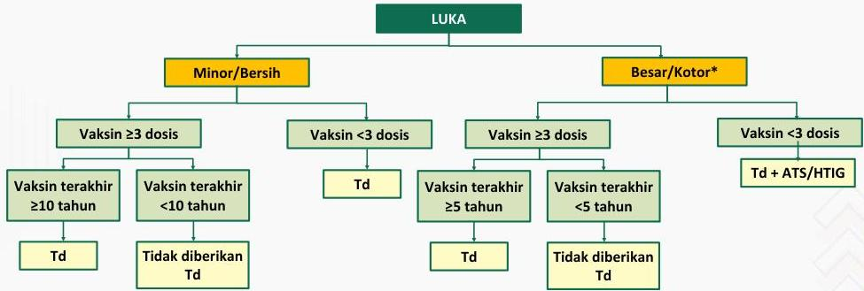

#

Profilaksis tetanus pada manajemen luka

*Kedalaman luka &gt;1 cm, konfigurasi stelata/avulsi, luka bakar/KLL, luka terkontaminasi feses dan saliva

Kelon Complete Batch Nov 2025

MEDIKO.ID

(KEMENKES, 2022) Hal. 506

4A