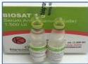
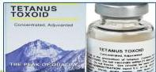

4A

# TATALAKSANA FARMAKOLOGI

## ANTI-TETANUS

- Human tetanus immunoglobulin (TIG) 3000-6000 U (IM) single dose.
- Anti Tetanus Serum (ATS) 50.000 U (IM) diikuti 50.000U (infus lambat) → skin test

## ANTIBIOTIK

- Metronidazole 500 mg/6-8 jam (IV) selama 7-10 hari atau
- Penicillin G 2-4 juta unit/ 4-6 jam (IV) selama 7-10 hari atau

## ANTI-KEJANG

- Benzodiazepine : diazepam 5 mg (IV) atau lorazepam 2 mg (IV), dinaikkan bertahap
- Bila pasien kejang, berikan diazepam 0,5 mg/kg/kali (IV bolus lambat) dengan dosis optimum 10 mg/kali tiap kejang. Kemudian diikuti diazepam per oral 0,5 mg/kg/kali tiap 4.

# TATALAKSANA

- Perawatan di ruang isolasi (gelap dan tenang)
- Hindari stimulus taktil atau suara pada pasien
- Pembersihan dan debridement luka kotor

# MEDIKOLOGIC

AnTok ABAng Vaksin

1. Anti Toksin : HTIG/ATS
2. Antibiotik :
Metronidazole/Penicillin
3. Anti-Kejang : Diazepam
4. Vaksin : TT

Kelon Complete Batch Nov 2025

MEDIKO.ID

(KEMENKES, 2022) Hal. 506