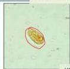
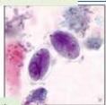
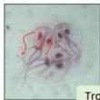
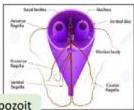
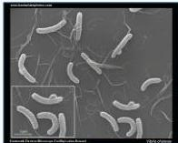
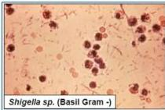
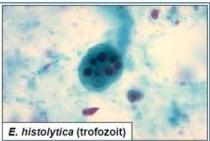
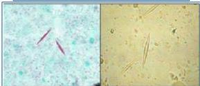

Gelon Complete Batch Nov 2025

MEDIKO.ID

(KEMENKES, 2022) Hal. 240

4A

# Giardia lamblia

|  Vibrio cholera | Diare seperti cucian beras | Dewasa: Doksisiklin 300mg SD, Azitromisin 1 gr SD, Tetrasiklin 4x500mg 3 hari, Eritromisin 4x500mg 3 hari
Anak: Azitromisin 20 mg/kgBB SD, Eritromisin 4x12,5mg/kgBB 3 hari, Doksisklin 2-4mg/kgBB SD  |
| --- | --- | --- |
|  C. difficile | Pemakaian antibiotik lama (klindamisin, amoksisilin, sefalosporin) | Metronidazole 3x500mg  |

Kista

Tropozoit

Shigella sp. (Basil Gram -)

E. histolytica (trofozoit)

Kristal Charcot Leyden