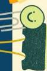

Atria.

# Algoritma Tes Schilling

1. 
$\mathsf{B}_{12}$ radiolabeled PO + $\mathsf{B}_{12}$ unlabeled IM
$\succ$ &lt;10% $\mathsf{B}_{12}$ radiolabeled
pada urine 24 jam

2. 
$\mathsf{B}_{12}$ radiolabeled PO + faktor intrinsik IM
$\succ$ &lt;10% $\mathsf{B}_{12}$ radiolabeled
pada urine 24 jam

3. 
$\mathsf{B}_{12}$ radiolabeled PO + antibiotik PO
$\succ$ &lt;10% $\mathsf{B}_{12}$ radiolabeled
pada urine 24 jam

4. 
$\mathsf{B}_{12}$ radiolabeled PO + enzim pankreas PO
$\succ$ &lt;10% $\mathsf{B}_{12}$ radiolabeled
pada urine 24 jam

2. 
$\geq 10\%$ $\mathsf{B}_{12}$ radiolabeled
pada urine 24 jam

3. 
$\geq 10\%$ $\mathsf{B}_{12}$ radiolabeled
pada urine 24 jam

$\succ$ Intake $\mathsf{B}_{12}$ ↓ (Malnutrisi)

$\succ$ IF ↓ (Anemia pernisiosa)

$\succ$ Overpopulasi bakteri usus

$\succ$ Insufisiensi pankreas

$\succ$ Pikirkan etiologi lain (mis. reseksi ileum)