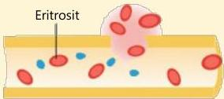
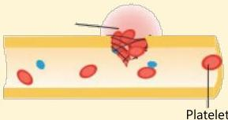
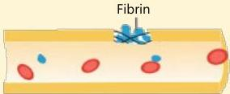

Eritrosit

Atria.

1. Vasokonstriksi

2. Platelet plug formation

3. Clot formation

# Fisiologi Hemostasis

Hemostasis ada 3 langkah:

- Hemostasis primer:

1. Vasokonstriksi
- Terjadi vasokonstriksi dan aktivasi vWF segera setelah perlukaan

2. Platelet plug formation
- Adhesi, aktivasi, dan agregasi platelet

- Hemostasis sekunder:

3. Clot formation → kaskade koagulasi
- Aktivasi kaskade koagulasi, terbentuk fibrin