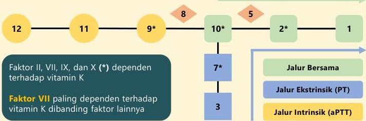

Atria.

|  Langkah Hemostasis |   | Pemeriksaan Penunjang | Nilai Normal | Kelainan  |
| --- | --- | --- | --- | --- |
|  1. Vasokonstriksi |   | Bleeding time (BT) | 2 – 5 menit | -  |
|  2. Platelet plug |   |   |   | Penyakit von Willebrand, DIC, trombositopenia lainnya  |
|  3. Clot formation |   | Clotting time (CT) | 2 – 8 menit | Hemofilia, defisiensi vit. K  |
|  - | Jalur ekstrinsik | PT | 11,0 – 12,5 detik | Defisiensi vit. K  |
|  - | Jalur intrinsik | aPTT | 30 – 40 detik | Hemofilia, penyakit von Willebrand  |

Rujukan laboratorium: Mosby's Manual of Diagnostic and Laboratory Tests