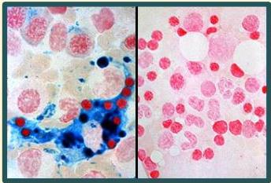

Atria.

# Anemia Defisiensi Besi

## Pemeriksaan Penunjang

- **Gold standard**: pewarnaan besi sumsum tulang dengan Prussian Blue → hasil negatif

Normal

ADB

Hemosiderin (bentuk penyimpanan besi) berwarna biru (hasil +)
Pada ADB, tidak ada cadangan besi → tidak terlihat warna biru (hasil -)