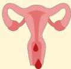

Atria.

# von Willebrand Disease

## Manifestasi Klinis:

Sering kali asimtomatis

## Perdarahan mukokutan

Misalnya ekimosis, epistaksis, petekie, dll.

## Perdarahan saluran cerna

Hematemesis – melena

## Menorrhagia