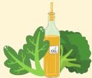
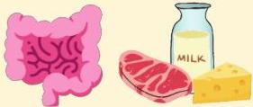
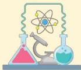

Atria.

# Jenis Vitamin K

## Vitamin K₁ (phytomenadione/phytonadione/phylloquinone)

- Banyak ditemukan pada sayuran hijau dan minyak-minyakan

## Vitamin K₂ (menaquinone)

- Dapat dibentuk dari vitamin K₁ oleh flora normal usus
- Banyak ditemukan pada daging-dagingan dan produk dairy (susu, keju)

## Vitamin K₃ (menadione)

- Sintetik, sudah tidak digunakan karena risiko terjadi anemia hemolitik