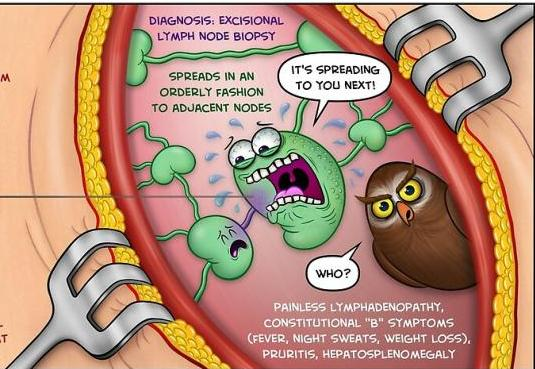

Atria.

# Limfoma Hodgkin

## HODGKIN LYMPHOMA

CLONAL B-CELL MALIGNANCY THAT DEVELOPS WITHIN THE LYMPHATIC SYSTEM

THE MALIGNANT REED-STERNBERG CELL TYPICALLY HAS A BILBOED NUCLEUS THAT GIVES AN "OWL'S EYES" APPEARANCE

DIAGNOSIS: EXCISIONAL LYMPH NODE BIOPSY

SPREADS IN AN ORDERLY FASHION TO ADJACENT NODES

IT'S SPREADING TO YOU NEXT!

WHO?

PAINLESS LYMPHADENOPATHY, CONSTITUTIONAL "B" SYMPTOMS (FEVER, NIGHT SWEATS, WEIGHT LOSS), POURITIS, HEPATOSPLENOMEGALY

WWW.MEDCOMIC.COM

© 2018 JORGE MUNIZ

Sumber Gambar: Medcomics