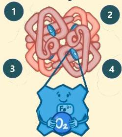
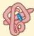
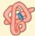
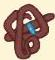
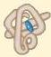
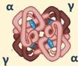
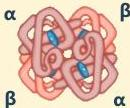
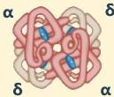

Atria.

# Fisiologi Hemoglobin

## Hemoglobin terdiri dari:

4 ranglieks heme

## Jenis rantai globin:

Rantai alpha (α)

Rantai beta (β)

Rantai gamma (γ)

Rantai delta (δ)

## Jenis Hemoglobin (Hb) yang paling umum:

HbF (Fetal)
(1-2% pada dewasa)

HbA (Adult)
(95-98% pada dewasa)

HbA₂
(2-3% pada dewasa)

Sumber: Osmosis.org