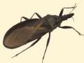

Atria.

# Tripanosomiasis

|  Tripanosomiasis Amerika | Tripanosomiasis Afrika  |
| --- | --- |
|  Chagas disease | Sleeping sickness  |
|  Daerah tropis dan subtropis
(Meksiko, Amerika tengah dan Selatan) | Daerah sosioekonomi rendah,
endemis pada sub-Sahara  |
|  Vektor: kissing bug
(Triatomine bugs) | Vektor: lalat Tsetse
(Glossina spp.)  |
|  khas: Romana’s sign
(edema palpebra unilateral) | khas: Winterbottom sign
(limfadenopati leher posterior)  |

