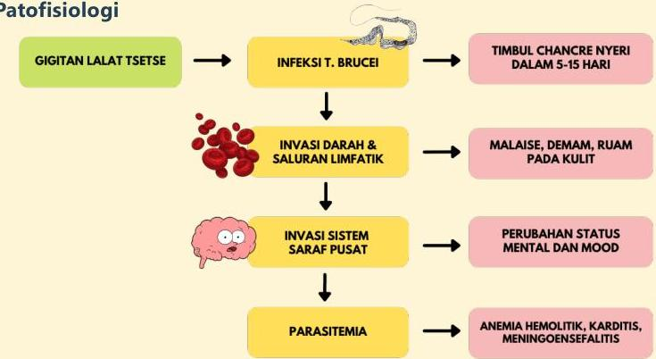

Atria.

# Tripanosomiasis Afrika

Patofisiologi

GIGITAN LALAT TSETSE → INFEKSI T. BRUCEI → TIMBUL CHANCRE NYERI DALAM 5-15 HARI
↓
INVASI DARAH &amp; SALURAN LIMFATIK → MALAISE, DEMAM, RUAM PADA KULIT
↓
INVASI SISTEM SARAF PUSAT → PERUBAHAN STATUS MENTAL DAN MOOD
↓
PARASITEMIA → ANEMIA HEMOLITIK, KARDITIS, MENINGOENSEFALITIS