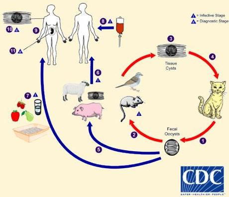

Atria.

Diagnosis dengan 10. **Biopsi** dan 11. **PCR**

# Daur Hidup Toksoplasma

1. **Ookista** pada tanah atau feses kucing
2. Kontaminasi ke tanah, air, tanaman → termakan tikus dan burung
3. **Ookista** transformasi menjadi **takizoit**, berkembang menjadi **bradizoit** di jaringan
4. Termakan kembali oleh kucing
5. Kucing dan hewan lain dapat terinfeksi dengan ingesti **ookista** tersporulasi di lingkungan

**Manusia dapat terinfeksi melalui rute:**

6. Daging hewan yang **tidak matang**
7. Air/makanan yang terkontaminasi feses kucing
8. Transfusi darah/transplantasi organ
9. Transplasenta **ibu-fetus**