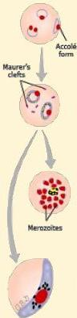
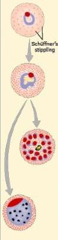
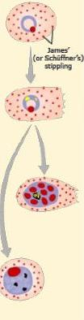
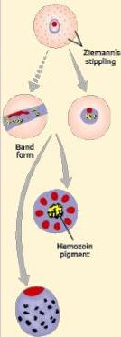

Atria.

# Morfologi eritrosit pada infeksi plasmodium

P. falciparum
Aczolé form
Maurer's clefts
Trophozoite
Ring

P. vivax
Schüffner's stippling

P. ovale
James' (or Schüffner's) stippling

P. malariae or P. knowlesi
Ziemann's stippling

Gametocyte
Schizont®