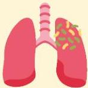
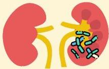

Atria.

# Sepsis

Definisi: Keadaan mengancam jiwa yang disebabkan respon inflamasi yang berlebih terhadap suatu infeksi

## Etiologi:

- Infeksi → paling sering oleh bakteri

Pneumonia

Abses intra-abdomen

Pyelonefritis