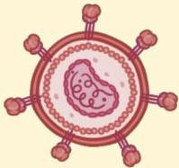

Atria.

# HIV

Definisi: Kumpulan gejala atau penyakit yang disebabkan oleh **menurunnya kekebalan tubuh** akibat **infeksi virus HIV** (Human immunodeficiency virus).

Etiologi → single-stranded (+) RNA

- HIV-1: paling sering
- HIV-2: hanya ditemukan di Afrika Barat

## Transmisi:

- **Seksual** (~80% kasus)
- Parenteral, melalui penggunaan jarum suntik bergilir
- Vertikal dari ibu ke anak, pada saat melahirkan per vaginam atau menyusui