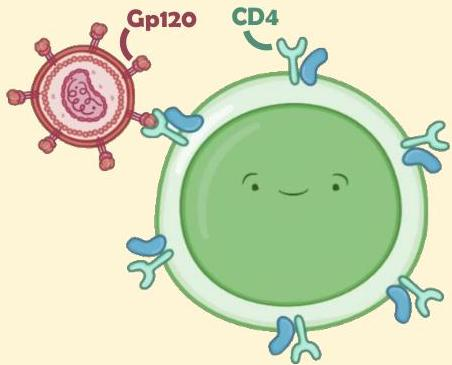

HIV

Atria.

# Patogenesis:

Virus HIV menyerang sel yang memiliki reseptor CD4, yaitu:

- T-helper
- Makrofag

Virus kemudian memasukkan RNA nya ke sitoplasma dan diubah ke bentuk DNA dengan enzim reverse transcriptase