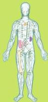
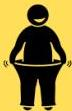
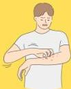

Atria.

# Stadium HIV Sederhana

## STADIUM I

Asimptomatis

Limfadenopati Generalisata

## STADIUM II

BB turun &lt;10%

ISPA berulang

Gangguan Kulit

Herpes Zoster
Cheilitis angularis
Dermatitis seboroik
Onychomycosis