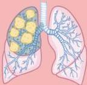
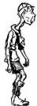
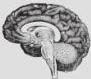
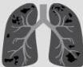
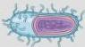

Atria.

# Stadium HIV Sederhana

## STADIUM III

BB turun &gt;10%

Diare &gt;1 bulan

Demam &gt;1 bulan

Gangguan Mulut
Kandidiasis oral
Gingivitis nekrotikans
Oral hairy leukoplakia

Tuberkulosis Paru

## STADIUM IV

Wasting Syndrome
- BB turun &gt;10% + Muscle wasting atau BMI &lt;18.5
DAN
- Salah satu:
- Diare &gt;1 bulan
- Demam &gt;1 bulan

Gangguan Otak
- Meningitis kriptokokus
- Ensefalitis toksoplasma
- Progressive multifocal leukoencephalopathy

Pneumocystis Pneumonia

Tuberkulosis Ekstraparu