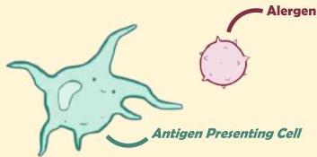
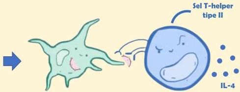

Atria.

# Reaksi Tipe I (Immediate)

## Patofisiologi

Allergen awalnya dikenali oleh antigen presenting cell. APC kemudian menelan allergen ini untuk diperkenalkan ke sel T di limfonodus

Sel T-helper
tipe II

Sel T-helper
tipe II

IL-4

Sel T yang mengenali antigen tersebut berubah menjadi sel Th-2 dan melepaskan IL-4 untuk memberitahu sel B agar membentuk antibodi