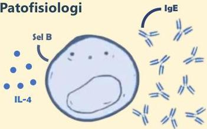
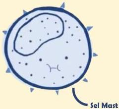

Atria.

# Reaksi Tipe I (Immediate)

IL-4 akan merangsang sel B untuk menghasilkan antibodi IgE yang akan menempel pada sel mast

Setelah sel mast ditempeli oleh IgE, maka fase sensitisasi telah selesai