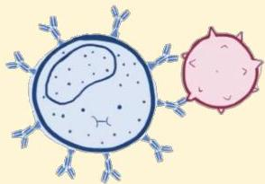
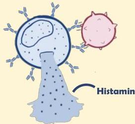

Atria.

# Reaksi Tipe I (Immediate)

## Patofisiologi

Fase elisitasi dimulai saat sel mast yang telah ditempeli IgE mengenali antigen yang sama

Sel mast akan berdegranulasi dan mengeluarkan histamin sehingga menyebabkan gejala alergi/asma hingga anafilaksis