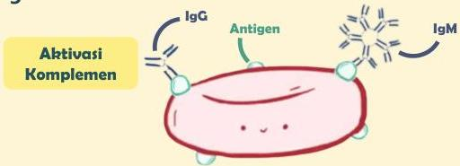

Atria.

# Reaksi Tipe II (Sitotoksik)

## Patofisiologi

Reaksi hipersensitivitas tipe II dimulai ketika ada antibodi IgG atau IgM yang mengenali antigen yang menempel pada permukaan sel (mis. sel darah merah)

Gabungan antibodi dan antigen ini kemudian mengaktivasi sistem komplemen dapat membunuh sel dalam 3 mekanisme, antara lain:

- Mekanisme 1: Degranulasi neutrofil
- Mekanisme 2: Membrane attack complex
- Mekanisme 3: Fagositosis