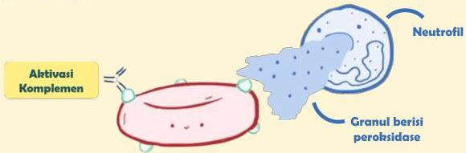

Atria.

# Reaksi Tipe II (Sitotoksik)

Patofisiologi: Mekanisme 1

Komplemen yang teraktivasi dapat **memanggil neutrofil** dan merangsangnya untuk degranulasi

Granul neutrofil memiliki **enzim peroksidase** yang dapat membentuk radikal bebas dan berujung pada **kematian sel**