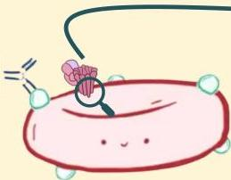
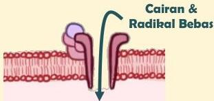
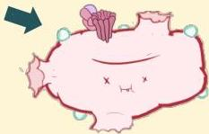

Atria.

# Reaksi Tipe II (Sitotoksik)

Patofisiologi: Mekanisme 2

Aktivasi Komplemen

Di membran sel, MAC membentuk saluran sehingga cairan dan radikal bebas dapat masuk ke dalam sel

Sel yang menggembung kemudian akan mengalami kematian akibat lisis