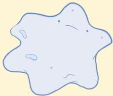
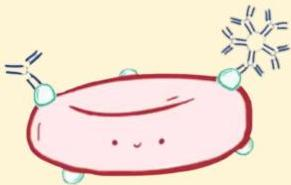

Atria.

# Reaksi Tipe II (Sitotoksik)

Patofisiologi: Mekanisme 3

Aktivasi Komplemen

Pada mekanisme ke-3, komplemen yang teraktivasi menarik fagosit (biasanya makrofag) ke tempat tersebut

Fagosit kemudian menelan sel tersebut dan menghancurkannya