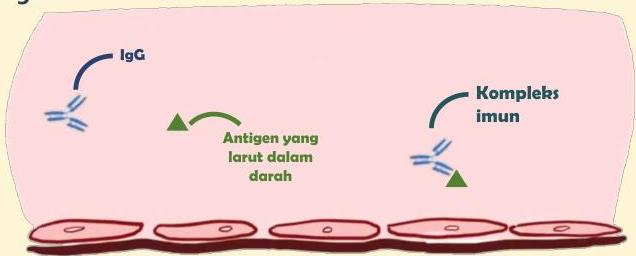

Atria.

# Reaksi Tipe III (Immune-Complex)

## Patofisiologi

Reaksi hipersensitivitas tipe III mirip dengan tipe II namun menarget antigen yang larut dalam darah

Gabungan antigen dan antibodi ini disebut dengan kompleks imun