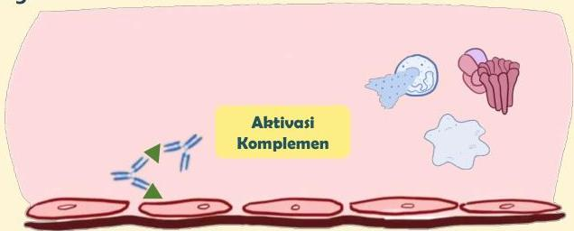

Atria.

# Reaksi Tipe III (Immune-Complex)

## Patofisiologi

Kompleks imun akan mengikuti peredaran darah, dan sering kali menumpuk pada organ/jaringan

Bila menempel pada tempat tersebut, kompleks imun akan **mengaktivasi** **komplemen** yang merusak sel dengan mekanisme yang sama dengan reaksi tipe II