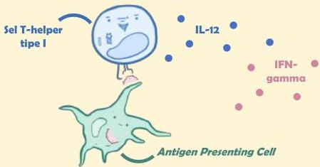

Atria.

# Reaksi Tipe IV (Delayed-Type)

## Patofisiologi

Pada reaksi hipersensitivitas tipe IV, antigen difagosit dan dipresentasikan oleh APC ke **sel T-helper** melalui MHC tipe II

Sel Th-1 akan menghasilkan IL-12 dan IFN gamma yang **menarik makrofag** ke area tersebut