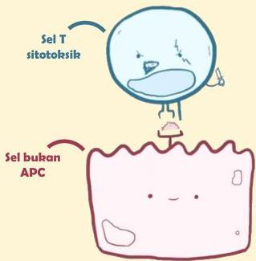

Atria.

# Reaksi Tipe IV (Delayed-Type)

## Patofisiologi

Reaksi tipe IV juga bisa melibatkan sel **T-sitotoksik (CD8)**. Hal ini terjadi bila antigen dipresentasikan **oleh sel jaringan** (bukan APC) melalui **MHC Tipe I**

MHC tipe I dapat ditemukan hampir pada semua jenis sel tubuh