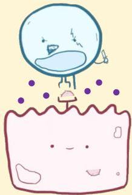

Atria.

# Reaksi Tipe IV (Delayed-Type)

## Patofisiologi

Sel T sitotoksik menghasilkan granzyme yang dapat masuk ke dalam sel. Terbentuk pori-pori pada sel yang menginduksi sel untuk melakukan apoptosis

Mekanisme ini ditemukan pada pasien dengan tiroiditis Hashimoto maupun DM tipe I