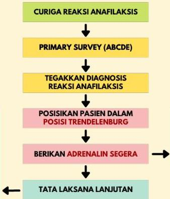

Atria.

# Algoritma Tata Laksana

TATA LAKSANA LANJUTAN:
- SUPLEMENTASI OKSIGEN
- PASANG JALUR INFUS
- ANTIHISTAMIN &amp; KORTIKOSTEROID
- PASANG MONITOR &amp; PANTAU TANDA VITAL

ADRENALIN/EPINEFRIN IM 1:1000
- DOSIS 0,3 - 0,5 ML
- SUNTIK DI VASTUS LATERALIS
- ULANGI 5-15 MENIT

Sumber: Algoritma Anafilaksis, UK Resuscitation Council