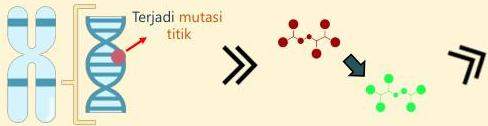
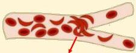

Atria.

# Anemia Sel Sabit

## Patofisiologi:

Gen rantai globin β (Kromosom 11)

Terbentuk HbS yang menyebabkan eritrosit berbentuk sabit

Eritrosit sabit bersifat kaku dan dapat saling menumpuk → oklusi → iskemi jaringan

Membran sel eritrosit sabit tidak elastis dan mudah rusak → Hemolisis