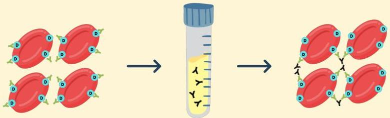

Atria.

# Indirect Coomb's Test: Step 2

Antibodi ibu akan menempel pada antigen Rh

Darah tersebut ditambah dengan serum Coomb's yang memiliki antibody terhadap antibody ibu

Darah tersebut ditambah dengan serum Coomb's beraglutinasi → Indirect Coomb's test (+)