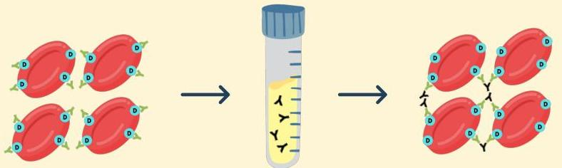

Atria.

# Direct Coomb's Test

Darah janin Rh (+) yang telah ditempel oleh antibodi ibu diambil oleh pemeriksa

Darah tersebut ditambah dengan serum Coomb's yang memiliki antibodi terhadap antibodi ibu

Darah tersebut ditambah dengan serum Coomb's beraglutinasi → Direct Coomb's test (+)