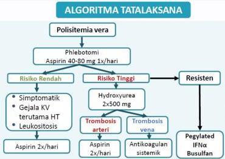

#

# RASIONALE

Keluhan nyeri kepala, mudah lelah dan sering merasa kebas pada tangan + TD 175/100 mmHg, Hb 20 g/dL, RBC 12 juta/ml, Ht 55%, WBC 28.000, PLT 650.000 → Dx. POLISITEMIA

A. Pemberian terapi kelasi (tatalaksana hemokromatosis)
B. Pemberian eritropoietin (tatalaksana anemia penyakit kronis ec. CKD)
C. Pemberian kortikosteroid (tatalaksana AIHA / tatalaksana awal anemia aplastik)
D. Melakukan flebotomi
E. Pemberian zat besi (tatalaksana anemia defisiensi besi)

Kelon Complete Batch Nov 2025

MEDIKO.ID

ASSOCIATION FOR THE STUDY