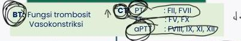

2

# GANGGUAN HEMOSTASIS

|  Gangguan Hemostasis Primer |   |   | Gang. Hemostasis Sekunder |   | Campuran  |   |
| --- | --- | --- | --- | --- | --- | --- |
|  **HSP** | **Von Willebrand Disease** | **ITP** | **Hemofilia A, B, C** | **APCD/ Defisiensi Vit K** | **DVT** | **DIC**  |
|  Vaskulitis dimediasi IgA | Defisiensi von willebrand factor | Autoimun (HS tipe II) | Defisiensi fakor VIII/IX/XI | Defisiensi fakor koagulasi dependen vit.K | Stasis vena, gangguan vascular, hiperkoagulasi | Gangguan trombosis, koagulasi, dan multiorgan  |
|  Platelet N Serum IgA ↑ | BT ↑ Ristocetin (+) vWF << | BT ↑ Platelet ↓ | CT, APTT ↑ Faktor VIII/IX/XI << | CT, PT ↑ Faktor II/VII << | BT, CT ↑ D-dimer ↑ | BT, CT ↑ D-dimer ↑ Fibrinogen ↓ Trombosit N/↓  |
|  Gangguan Vasokonstriksi | Gangguan Trombosit |   | Gangguan Koagulasi |   | Gangguan Pemecahan Fibrin  |   |

Kelon Complete Batch Nov 2025

MEDIKO.ID

ASSOCIATION FOR THE STUDY