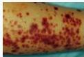
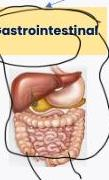
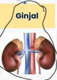

HENOCH SCHONLEIN PURPURA (HSP)

Vascular

PR

# DEFINISI

- Vaskulitis dimediasi imun yang melibatkan pembuluh darah kecil di berbagai organ
- Vasculitis sistemik tersering pada anak
- Berhubungan dengan Berger Disease (IgA nefropati)

# KLAI KUMOT

Palpable purpura

# PLATOFISIOLOGI

Riwayat ISP / Infeksi gastrointestinal, paparan obat

Aktivasi imun dan pembentukan kompleks antigen-antibodi

Deposit IgA di pembuluh darah organ

# KLINIS

- Palpable purpura + ptekiae, dominan pada ekstremitas bawah
- Nyeri abdomen akut, intususepi (ileoileal)
- Hematuria/proteinuria (mikroskopis)
- Arthralgia atau artritis akut

Kelon Complete Batch Nov 2025

MEDIKO.ID

(AAFP, 2020) Hal. 229