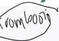

2

# HENOCH SCHONLEIN PURPURA (HSP)

## DIAGNOSIS

Tidak diperlukan untuk diagnosis vaskulitis IgA
Pemeriksaan dilakukan untuk eksklusi penyebab dan identifikasi komplikasi (glomerulonephritis, GI bleeding) → DL profil koagulasi, elektrolit, fungsi ginjal, urinalisis
Endoskopi → keterlibatan GI/perdarahan pulmonal

## MEDIKOLOGIC

HENO Sekolah Online &amp; PaPa beli BERGER rasa IgA
Henoch Schonlein Purpura Palpable - berger disease (IgA nefropati)

## TATALAKSANA

- Biasanya self-limiting (1-6 minggu)
- Terapi suportif: analgesik (Paracetamol, NSAID), istirahat, hidrasi. Hindari NSAID pada keterlibatan ginjal
- Terapi imunosupresif: steroid IV dosis tinggi atau cyclosporin
- Dapat mengurangi edema jaringan dan peradangan arthralgia
- Digunakan untuk terapi glomerulonephritis pada gejala ginjal berat
- Tidak mengurangi rekurensi dan durasi pengobatan

Kelon Complete Batch Nov 2025

MEDIKO.ID
ASSOCIATION OF THE ASSOCIATES
(AAFP, 2020) Hal. 231