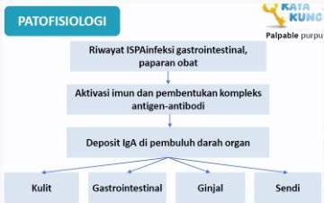

#

RATIONALE

Keluhan demam, nyeri lutut dan perut, serta bintik-bintik merah yang menonjol (palpable purpura) di area tangan + Riwayat ISPA (+) → sehingga diagnosis yang paling mungkin ialah HENOCH SCHONLEIN PURPURA

A. ITP (trombositopenia, petekia / purpura non-palpable)
B. Henoch-Schonlein Purpura
C. DHF (demam, manifestasi perdarahan)
D. DIC (manifestasi perdarahan dengan pencetus, gangguan koagulasi)
E. Hemofilia (gangguan koagulasi, manifestasi perdarahan sulit berhenti)

Kelon Complete Batch Nov 2025

MEDIKO.ID

ASSOCIATION FOR MEDICINE